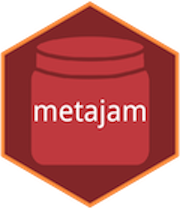

```{r setup, include=FALSE, }
knitr::opts_chunk$set(echo = FALSE)
```


`metajam` is an R package to ease the Download and import of data and metadata from repositories in the DataONE network into R.


Package website: https://nceas.github.io/metajam/

```{r fig.align='center'}

```


