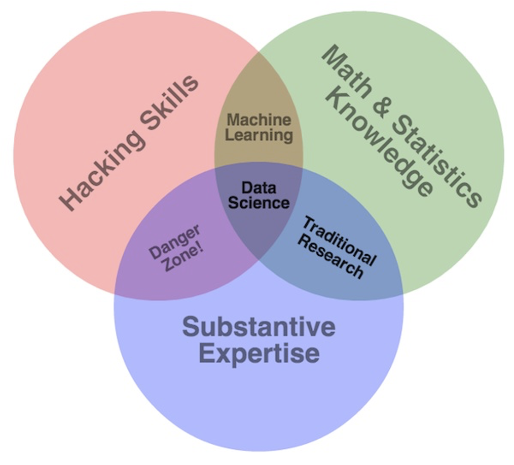

## Curriculum at a glance

This training brought together Science for Nature and People Partnership (SNAPP) postdoctoral associates and technical liaisons to foster community and collaboration, as well as promote scientific computing and open science best practices. Topics included data modeling, manipulation and visualization; collaborative and open science principles and techniques; geospatial analysis; and coding best practices.


```{r fig.align='center', fig.cap="Image Attribution: Drew Conwa http://drewconway.com/zia/2013/3/26/the-data-science-venn-diagram"}

```

<br>

**Workshop material:**

- materials: https://github.com/NCEAS/2016-postdoc-training
