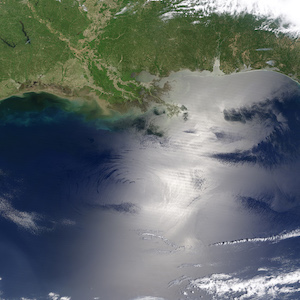

## Curriculum at a glance

The primary goal of the 3-week Open Science for Synthesis - Gulf Research Program Workshop is to provide hands-on experience with contemporary open science tools from command line to data to communication. Team science is promoted. Practice and real data are used in groups to apply skills we explore.

**Week 1**. Fundamental collaboration skills
Introduction to command line, communicating science, R, meta-analysis and data management.

**Week 2**. Advanced topics
Tabular data, programming, Python, workflows, reproducible science and metagenomics.

**Week 3**. Advanced topics & group projects
Communication, geospatial analysis, data viz, and group project sharing.


```{r fig.align='center'}

```

<br>

**Workshop material:**

- website: https://nceas.github.io/oss-2017/index.html
- materials: https://nceas.github.io/oss-2017/lessons.html
