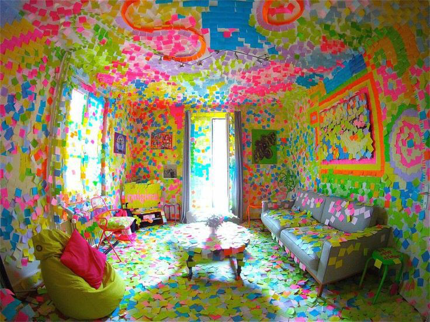

```{r setup, include=FALSE}
knitr::opts_chunk$set(echo = FALSE)
```

## Curriculum at a glance 

Participants will use of `rmarkdown` and `ggplot2` to create document integrating R code, documentation and data visualization in compelling documents. The first half of the session will be focusing on an introduction to Rmarkdown and how this format can be used to make data processing and analysis more reproducible by combining, documentation and executable code chunks into one document, that can be rendered in different formats (html, PDF, …) to be shared. In the second half of this workshop, participants will take a deeper look into data visualization and how `ggplot`’s grammar of graphics approach can be used to conduct powerful data exploration and analysis visualizations. Basic knowledge of the R programming language recommended.

```{r fig.align='center'}

```

<br>

**Workshop material:**

- Repository: https://github.com/brunj7/reproducible-dataviz
- Presentation: https://brunj7.github.io/reproducible-dataviz/rmarkdown-intro_deck.html

**Event Link**: https://2018lterallscientistsmeeting.sched.com/event/FYq5