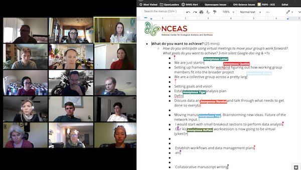

```{r setup, include=FALSE}
knitr::opts_chunk$set(echo = FALSE)
```

## Curriculum at a glance 

This 3-hour module provides mentorship and facilitation training for teams (Working Groups) to develop skill sets, habits, and mindsets to make remote work and collaborative synthesis science more efficient and resilient.

```{r fig.align='center'}

```

<br>

**Workshop material:**
https://docs.google.com/document/d/1-rm903_Er4fgKVHxYSSqCnAMEGssiJw-7t9htbC4IVk/edit?usp=sharing

**Blog post:** https://www.nceas.ucsb.edu/news/kick-starting-scientific-collaborations-remotely