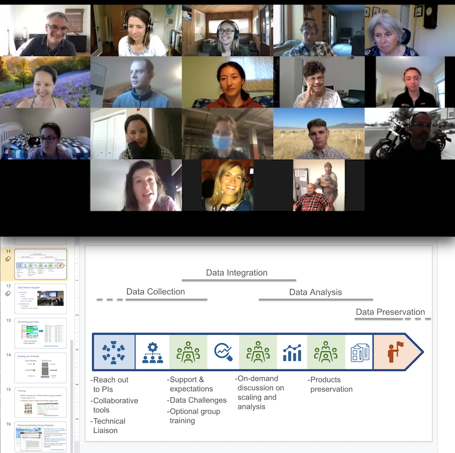

```{r setup, include=FALSE}
knitr::opts_chunk$set(echo = FALSE)
```

## Curriculum at a glance 

This module is an introduction to the data science support [NCEAS](https://www.nceas.ucsb.edu/) is providing to [LTER](https://lternet.edu/) and [SNAPP](https://snappartnership.net/) working groups followed by a discussion on best practices about data management in a distributed team setup. Participants will have the opportunity to brainstorm on their data and computing needs. In the second part of the workshop, an introduction to the use of NCEAS analytical server and the concept of collaborative coding as a distributed team will be demonstrated to empower participants to develop their analytical workflows in a remote setup.

```{r fig.align='center'}

```

<br>

**Workshop material:**
https://docs.google.com/document/d/1cTIYyfc0J564PxpF0-xE_bbH6TIK2tq1F5WkDOx0lrw/edit?usp=sharing

**Blog post:** https://www.nceas.ucsb.edu/news/developing-reproducible-workflows-collaboratively