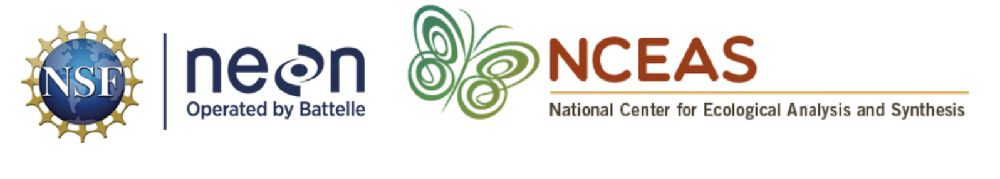

```{r setup, include=FALSE}
knitr::opts_chunk$set(echo = FALSE)
```

This onboarding document is designed to support researchers beginning their postdoctoral work with NEON in a way that provides access to information, resources and training in open practices and team science. Developing good data science skills will enable researchers to maximize their productivity, share their data with the scientific community effectively and efficiently, and benefit from the re-use of their data by others.

```{r fig.align='center'}

```

**Training website:**
https://learning.nceas.ucsb.edu/2020-12-neon/ 