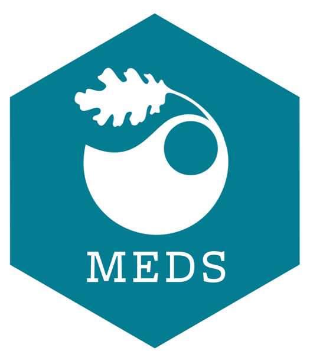

```{r setup, include=FALSE}
knitr::opts_chunk$set(echo = FALSE)
```

**Course syllabus:**

This course will cover the concept of metadata and how it can be leveraged for the integration of heterogeneous datasets into standardized data products. We will practice how to download data from data repositories both manually and programmatically relying on APIs. We will also discuss how to track the provenance of data, generate metadata integrating data semantics to increase data discovery, as well as archiving data products on data repositories to make them available to the broader community.

**Course website:**
<https://brunj7.github.io/EDS-213-metadata/>


```{r fig.align='center'}

```
