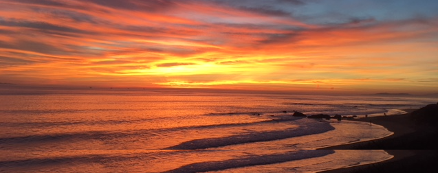

```{r setup, include=FALSE}
knitr::opts_chunk$set(echo = FALSE)

# Learn more about creating websites with Distill at:
# https://rstudio.github.io/distill/website.html

# Learn more about publishing to GitHub Pages at:
# https://rstudio.github.io/distill/publish_website.html#github-pages

```

```{r Sunset in Carp, out.width = "100%" }

```

<br>

Hi there, I am a **Senior Data Scientis** at the National Center for Ecological Synthesis and Analysis ([NCEAS](http://www.nceas.ucsb.edu)), affiliated to University California Santa Barbara (UCSB). 

Our center runs different highly interdisciplinary initiatives ranging from the integration of nature conservation practices with human health and well-being to investigating the Ocean Health. For each critical challenge NCEAS awards after a proposal review process, a Working Group is formed of around 15-20 multi-disciplinary US and international experts from academia, NGOs, administrations and private sectors. NCEAS strives to help these working groups to do science differently by promoting and supporting best practices in open, team and data sciences. 

The **core of my work** is to understand data and computing challenges our working group members are facing and help them to translate these challenges into solvable tasks. I advise and train them on how to clean, structure (data modeling), combine and analyze their heterogeneous data sets, as well as scaling their analysis.  I am also an instructor in our data science training and summer school efforts teaching early career scientists data analysis and programming best practices, while promoting open and reproducible principles. 

My **scientific expertise** is in ecohydrology, Earth observation techniques (remote sensing and GIS) and process-based modelling. Prior conducting my PhD on the ecohydrological impacts of tropical cyclones in the Southeastern US, I conducted several projects on land cover change, vegetation monitoring and disaster mapping for governmental and international institutions.

Before this, I was a Data Engineer Lead in a tech company developing data pipelines to extract location insights from geospatial information.

I am also the maintainer for the `metajam` R package (https://cran.r-project.org/web/packages/metajam/) and the organizer of the [R Meetup](https://www.meetup.com/Santa-Barbara-R-Users-Group/) in the Santa Barbara area. Feel free to reach out if you have an idea and would like help to organize a meeting!

On the personal side, I enjoy chocolate crunching, downhill skiing, mountain biking and playing records on vintage Hi-Fi!